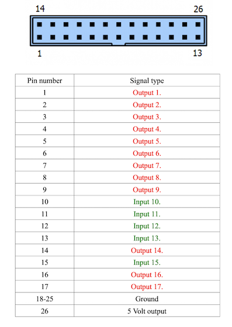

# Circle Tester

## Purpose
The aim of this project is to replicate, in part, the functionality of the hugely exensive ballbar calibration solutions.

This is really designed for home shops, and for me, was designed to work on a plasma table - something where 1/1000 of a mm isn't a real worry due to the nature of the plasma stream!

The ultimate aim of this was to allow me to adjust the backlash settings in UCCCNC, so there are some links below which talk more about this part of the process too.

## My test
In reality the test is simple, move the 'head' around a circle of known radius, and measure how far the radius varies throughout this sweep.  A 'perfect' setup has zero deviation from the true circle.  Professional setups also measure the Z axis (it seems - i've never seen a real test unit); but since this is for my plasma table, and i've got THC, i'll leave that for now (could put an angle sensor on at some point I suppose)

We run the test clockwise and anticlockwise to properly see any backlash in the system

Now, given that my ultimate goal is to set the backlash, 'where' on the circle the errors are isn't that important, its more that the circle is the best it can be, so I care about the total deviation over the entire sweep, as well as the maximum deviatoin at any point on that sweep.

## G-code
* Wait for an input: M66 P[pin] E[port] L[mode] Q[timeout in seconds] 
* M206 disable THC
* G02 / G03  clockwise and counterclockwise arc:   G02 X[x] Y[y] R[r] F[f]    x,y is the _end_ position, r is the radius, and f is the feed rate
* G90 set absolute position mode

## Connection
I have a cncdrive device, with two ports (https://cncdrive.com/UC400ETH.html), works well for me, and in this scenario leaves me a port free to control the capture device.

The pinout for mine is:

## Running the test
To be able to do this test in any repeatable way, we need to both be able to measure the deviation, but also synchronize the start and stop of the test.  I'm assuming that a professional setup also syncrhonises each step of the movement - in the first test we will just assume constant radial movement, i.e. in a second the head moves a known amount round 
the circle.

## Mounts
This was (for me) the hardest part of thinking this through - the accuracy of the whole setup is driven by the indicator, and how concentric the head and the base are when aligned.  Missalignment at this point means we optimise to correct for this as well as any backlash.  I do also realise that any manufacturing defects will impact this, but since i'm trying to get to the 1/100mm accuracy I hope this won't be a problem.   

Looking at various approaches I thought about standard bearings with a pivot, but this would have been very rigit in the z direction so hard to align. 

I found a video (can't re-find it to reference) which showed in effect a top and bottom 'cup' with a magnetic ball in the middle.  Bring the two cups near enough with the ball in the middle and they self aligned.  My version of this is a cheap photographic ball head and clamp, some 10mm magnetic balls, and a turned steel 'cup'.  I think you could also do the same thing with a steel ball, and those magnets with screw mounts and then very small screws / glue them down.  

Ultimately the setup is that you leave the tripod mount loose, put the ball in the top mount (the one on the plasma head) and then put the mount underneath, or jog the head close enough that the lower mount 'snaps' into alignment; then just tighted the bottom mount and assuming the pull is strong enough, the alignment should remain.  

From there, you just need to have corresponding cups mounted on the base and end of the indicator.  Here I just made some simple 3d printed parts to hold the mount and glued them in.  The nice thing about the 3d printed parts is that you can make them any shape to fit your scenario.  

The 'head' end is mounted by just clamping the drop bar to the head - the main thing here is this needs NOT TO FLEX when moved.

#### Future enhancememnts
If we break the circle down, into say 2mm movements around the circumference we can then run each segment in time, and if we index them, know where on the circle we are.  So instead of using a G02/03 with just a single I setting, we could do multiple arcs.  

## References
I've taken insirpiration from several places, so all credit to the sites and links below:

### Backlash
http://cncfaq.us/wp-content/uploads/2018/09/Stepcraft-UCCNC-Backlash-Compensation.pdf

#### Digital meter
https://www.amazon.co.uk/gp/product/B01H035DRO/ref=ppx_yo_dt_b_asin_title_o00_s00?ie=UTF8&psc=1
https://github.com/stawel/dialIndicatorToSerial
http://wei48221.blogspot.com/2016/01/using-digital-caliper-for-digital-read_21.html
https://hackaday.io/project/511-digital-dial-indicator-cnc-surface-probe

### Professional results
https://cnctechcanada.ca/ballbar-calibration/#iLightbox[gallery_image_1]/1

